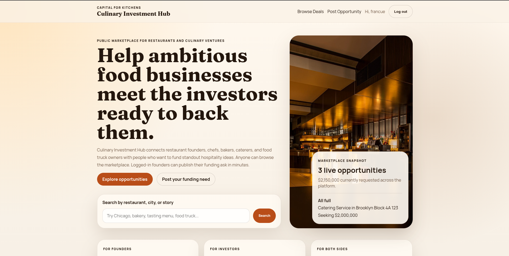
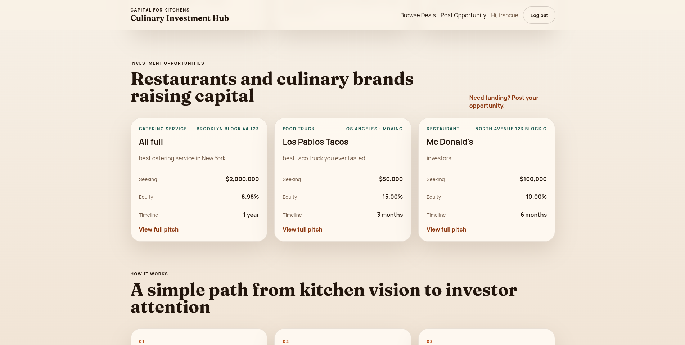
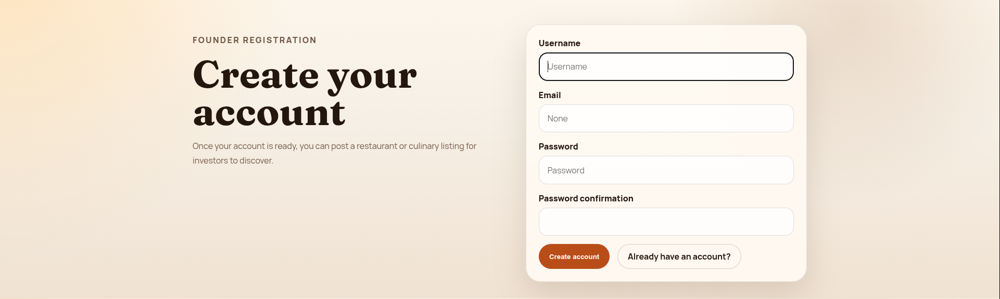
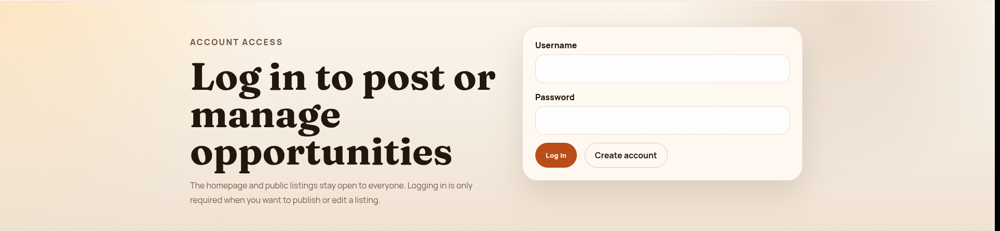
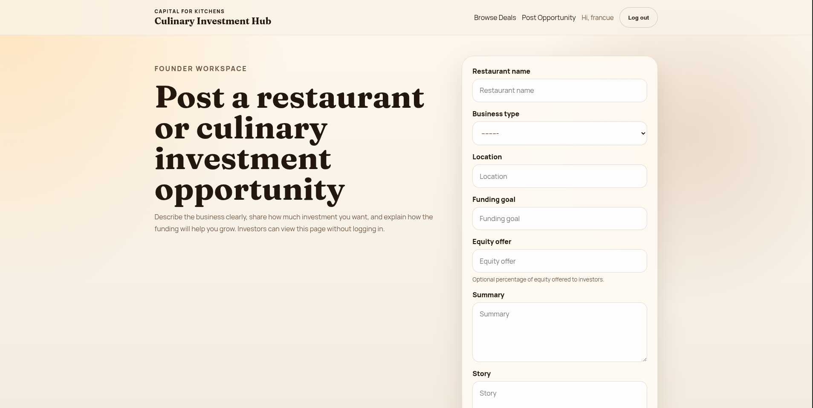
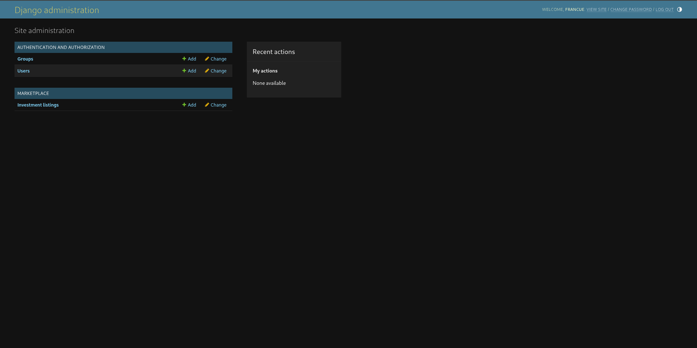
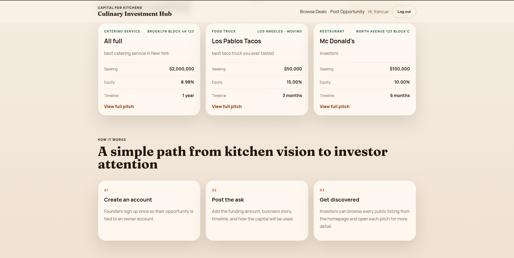

# Culinary Investment Hub

A Django marketplace where restaurant founders and culinary entrepreneurs can post public investment opportunities for investors to browse.

## What it does

- Public homepage with live restaurant and culinary funding opportunities
- Search by restaurant name, city, or pitch content
- User signup, login, and logout
- Posting, editing, and deleting opportunities for logged-in owners
- SQLite database through Django's default setup

## Tech stack

- Python
- Django
- SQLite
- HTML templates
- CSS

## Run locally

1. Install dependencies:

```bash
pip install -r requirements.txt
```

2. Set environment variables (example):

```bash
cp .env.example .env
export DJANGO_SECRET_KEY='replace-with-a-real-secret'
export DJANGO_DEBUG=True
export DJANGO_ALLOWED_HOSTS='127.0.0.1,localhost'
```

3. Run migrations:

```bash
python3 manage.py migrate
```

4. Start the development server:

```bash
python3 manage.py runserver
```

5. Open:

```text
http://127.0.0.1:8000/
```

## Main routes

- `/` public marketplace homepage
- `/accounts/signup/` create account
- `/accounts/login/` log in
- `/opportunities/new/` create a funding listing
- `/admin/` Django admin

## Screenshots

### Home



### Browse Deals



### Sign Up



### Log In



### Post Opportunity



### Admin



### Project Structure



## Testing

Run Django system checks:

```bash
python3 manage.py check
```

Run all tests:

```bash
python3 manage.py test
```

Run only marketplace app tests:

```bash
python3 manage.py test marketplace
```
